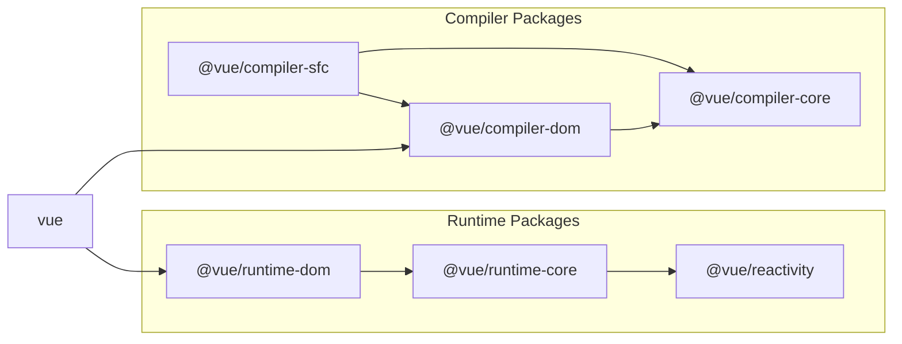

# Реализация компилятора шаблонов

## Подход к реализации

Основной подход заключается в манипулировании строкой, переданной через опцию template, для генерации определенных функций. \
Давайте разделим компилятор на три элемента.

### Парсинг

Парсинг включает извлечение необходимой информации из заданной строки. Вы можете представить это так:

```ts
const { tag, props, textContent } = parse(`<p class="hello">Hello World</p>`)
console.log(tag) // "p"
console.log(prop) // { class: "hello" }
console.log(textContent) // "Hello World"
```

### Генерация кода

Генерация кода создает код (строки) на основе результата парсинга.

```ts
const code = codegen({ tag, props, textContent })
console.log(code) // "h('p', { class: 'hello' }, ['Hello World']);"
```

### Генерация объекта функции

Генерация объекта функции создает исполняемые функции на основе кода (строк), сгенерированного функцией codegen. \
В JavaScript вы можете генерировать функции из строк, используя конструктор Function.

```ts
const f = new Function('return 1')
console.log(f()) // 1

// Если вы хотите определить аргументы, вы можете сделать это так
const add = new Function('a', 'b', 'return a + b')
console.log(add(1, 1)) // 2
```

Мы будем использовать это для генерации функций. \
Одна вещь, которую следует отметить здесь, это то, что сгенерированная функция может работать только с переменными, определенными внутри нее, поэтому нам нужно включить в нее импорт функций, таких как функция h.

```ts
import * as runtimeDom from './runtime-dom'
const render = new Function('ChibiVue', code)(runtimeDom)
```

Таким образом, мы можем получить runtimeDom как ChibiVue и включить функцию h на этапе генерации кода следующим образом:

```ts
const code = codegen({ tag, props, textContent })
console.log(code) // "return () => { const { h } = ChibiVue; return h('p', { class: 'hello' }, ['Hello World']); }"
```

Другими словами, ранее мы говорили, что будем преобразовывать это так:

```ts
;`<p class="hello">Hello World</p>`
// ↓
h('p', { class: 'hello' }, ['Hello World'])
```

Но если быть точным, мы преобразуем это так:

```ts
;`<p class="hello">Hello World</p>`

// ↓

ChibiVue => {
  return () => {
    const { h } = ChibiVue
    return h('p', { class: 'hello' }, ['Hello World'])
  }
}
```

И передаем runtimeDom для генерации функции рендеринга. \
Ответственность codegen заключается в генерации следующей строки:

```ts
const code = `
  return () => {
      const { h } = ChibiVue;
      return h("p", { class: "hello" }, ["Hello World"]);
  };
`
```

## Реализация

Когда вы поняли подход, давайте реализуем его. \
Создайте директорию `compiler-core` в `~/packages` и создайте в ней файлы `index.ts`, `parse.ts` и `codegen.ts`.

```sh
pwd # ~/
mkdir packages/compiler-core
touch packages/compiler-core/index.ts
touch packages/compiler-core/parse.ts
touch packages/compiler-core/codegen.ts
```

index.ts используется только для экспорта, как обычно.

Теперь давайте начнем реализацию с parse.
`packages/compiler-core/parse.ts`

```ts
export const baseParse = (
  content: string,
): { tag: string; props: Record<string, string>; textContent: string } => {
  const matched = content.match(/<(\w+)\s+([^>]*)>([^<]*)<\/\1>/)
  if (!matched) return { tag: '', props: {}, textContent: '' }

  const [_, tag, attrs, textContent] = matched

  const props: Record<string, string> = {}
  attrs.replace(/(\w+)=["']([^"']*)["']/g, (_, key: string, value: string) => {
    props[key] = value
    return ''
  })

  return { tag, props, textContent }
}
```

Хотя это очень простой парсер, использующий регулярные выражения, его достаточно для первой реализации.

Далее, давайте сгенерируем код. Реализуем его в codegen.ts.\
`packages/compiler-core/codegen.ts`

```ts
export const generate = ({
  tag,
  props,
  textContent,
}: {
  tag: string
  props: Record<string, string>
  textContent: string
}): string => {
  return `return () => {
  const { h } = ChibiVue;
  return h("${tag}", { ${Object.entries(props)
    .map(([k, v]) => `${k}: "${v}"`)
    .join(', ')} }, ["${textContent}"]);
}`
}
```

Теперь давайте реализуем функцию, которая генерирует строку функции из шаблона, объединяя эти компоненты.\
 Создайте новый файл `packages/compiler-core/compile.ts`.

`packages/compiler-core/compile.ts`

```ts
import { generate } from './codegen'
import { baseParse } from './parse'

export function baseCompile(template: string) {
  const parseResult = baseParse(template)
  const code = generate(parseResult)
  return code
}
```

Это не должно быть слишком сложно. Фактически, ответственность `compiler-core` на этом заканчивается.

## Компилятор времени выполнения и компилятор процесса сборки

На самом деле, Vue имеет два типа компиляторов. \
Один - это компилятор, который работает во время выполнения (в браузере), а другой - компилятор, который работает в процессе сборки (например, Node.js). \
В частности, компилятор времени выполнения отвечает за компиляцию опции template или шаблона, предоставленного в виде HTML, в то время как компилятор процесса сборки отвечает за компиляцию SFC (или JSX). \
Опция template, которую мы сейчас реализуем, относится к первой категории.

```ts
const app = createApp({ template: `<p class="hello">Hello World</p>` })
app.mount('#app')
```

```html
<div id="app"></div>
```

Шаблон, предоставленный в виде HTML, - это интерфейс разработчика, где вы пишете шаблоны Vue в HTML. \
(Это удобно для быстрого включения его в HTML через CDN и т.д.)

```ts
const app = createApp()
app.mount('#app')
```

```html
<div id="app">
  <p class="hello">Hello World</p>
  <button @click="() => alert('hello')">click me!</button>
</div>
```

Оба этих варианта нуждаются в компиляции, но компиляция выполняется в браузере.

С другой стороны, компиляция SFC выполняется во время сборки проекта, и только скомпилированный код существует во время выполнения. \
(Вам нужно настроить бандлер, такой как Vite или webpack, в вашей среде разработки.)

```vue
<!-- App.vue -->
<script>
export default {}
</script>

<template>
  <p class="hello">Hello World</p>
  <button @click="() => alert("hello")">click me!</button>
</template>
```

```ts
import App from 'App.vue'
const app = createApp(App)
app.mount('#app')
```

```html
<div id="app"></div>
```

Важно отметить, что оба компилятора имеют общую обработку. \
Исходный код для этой общей части реализован в директории `compiler-core`. \
А компиляторы времени выполнения и SFC реализованы в директориях `compiler-dom` и `compiler-sfc` соответственно. \
Пожалуйста, взгляните на эту диаграмму еще раз.



https://github.com/vuejs/core/blob/main/.github/contributing.md#package-dependencies

## Продолжение реализации

Мы немного забежали вперед, но давайте продолжим реализацию. \
Хотя я хотел бы реализовать `packages/index.ts`, есть некоторая подготовительная работа, так что давайте сделаем ее сначала. \
Подготовительная работа заключается в реализации переменной в `packages/runtime-core/component.ts` для хранения самого компилятора и функции регистрации.

`packages/runtime-core/component.ts`

```ts
type CompileFunction = (template: string) => InternalRenderFunction
let compile: CompileFunction | undefined

export function registerRuntimeCompiler(_compile: any) {
  compile = _compile
}
```

Теперь давайте сгенерируем функцию в `packages/index.ts` и зарегистрируем ее.

```ts
import { compile } from './compiler-dom'
import { InternalRenderFunction, registerRuntimeCompiler } from './runtime-core'
import * as runtimeDom from './runtime-dom'

function compileToFunction(template: string): InternalRenderFunction {
  const code = compile(template)
  return new Function('ChibiVue', code)(runtimeDom)
}

registerRuntimeCompiler(compileToFunction)

export * from './runtime-core'
export * from './runtime-dom'
export * from './reactivity'
```

※ Не забудьте экспортировать функцию `h` из `runtime-dom`, потому что она должна быть включена в `runtimeDom`.

```ts
export { h } from '../runtime-core'
```

Теперь, когда компилятор зарегистрирован, давайте фактически выполним компиляцию. \
Поскольку шаблон требуется в типе опций компонента, давайте добавим шаблон пока что.

```ts
export type ComponentOptions = {
  props?: Record<string, any>
  setup?: (
    props: Record<string, any>,
    ctx: { emit: (event: string, ...args: any[]) => void },
  ) => Function
  render?: Function
  template?: string // Добавлено
}
```

Теперь давайте скомпилируем важную часть.

```ts
const mountComponent = (initialVNode: VNode, container: RendererElement) => {
  const instance: ComponentInternalInstance = (initialVNode.component =
    createComponentInstance(initialVNode))

  // ----------------------- Отсюда
  const { props } = instance.vnode
  initProps(instance, props)
  const component = initialVNode.type as Component
  if (component.setup) {
    instance.render = component.setup(instance.props, {
      emit: instance.emit,
    }) as InternalRenderFunction
  }
  // ----------------------- До сюда

  setupRenderEffect(instance, initialVNode, container)
}
```

Мы извлечем вышеуказанную часть в `packages/runtime-core/component.ts`.

`packages/runtime-core/component.ts`

```ts
export const setupComponent = (instance: ComponentInternalInstance) => {
  const { props } = instance.vnode
  initProps(instance, props)

  const component = instance.type as Component
  if (component.setup) {
    instance.render = component.setup(instance.props, {
      emit: instance.emit,
    }) as InternalRenderFunction
  }
}
```

`packages/runtime-core/renderer.ts`

```ts
const mountComponent = (initialVNode: VNode, container: RendererElement) => {
  // prettier-ignore
  const instance: ComponentInternalInstance = (initialVNode.component = createComponentInstance(initialVNode));
  setupComponent(instance)
  setupRenderEffect(instance, initialVNode, container)
}
```

Теперь давайте выполним компиляцию внутри функции `setupComponent`.

```ts
export const setupComponent = (instance: ComponentInternalInstance) => {
  const { props } = instance.vnode
  initProps(instance, props)

  const component = instance.type as Component
  if (component.setup) {
    instance.render = component.setup(instance.props, {
      emit: instance.emit,
    }) as InternalRenderFunction
  }

  // ------------------------ Здесь
  if (compile && !component.render) {
    const template = component.template ?? ''
    if (template) {
      instance.render = compile(template)
    }
  }
}
```

Теперь мы должны быть в состоянии компилировать простой HTML, используя опцию `template`. \
Давайте попробуем это в playground!

```ts
const app = createApp({ template: `<p class="hello">Hello World</p>` })
app.mount('#app')
```


Похоже, все работает нормально. \
Давайте попробуем внести некоторые изменения, чтобы увидеть, отражаются ли они.

```ts
const app = createApp({
  template: `<b class="hello" style="color: red;">Hello World!!</b>`,
})
app.mount('#app')
```


Похоже, реализация выполнена правильно!

Исходный код до этого момента:  
[chibivue (GitHub)](https://github.com/chibivue-land/chibivue/tree/main/book/impls/10_minimum_example/060_template_compiler)
