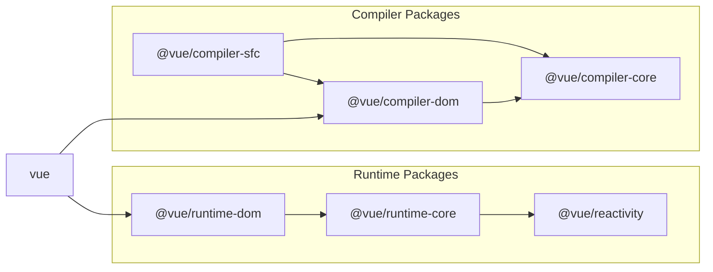

# Реализация парсера SFC

## Подготовка

Хотя это пример плагина, который мы создали ранее, давайте удалим его, так как он больше не нужен.

```sh
pwd # ~
rm -rf ./plugin-sample
```

Также установим основной пакет Vite для создания плагина Vite.

```sh
pwd # ~
ni vite
```

Это основная часть плагина, но поскольку это изначально находится за пределами vuejs/core, мы создадим директорию с названием `@extensions` в директории `packages` и реализуем его там.

```sh
pwd # ~
mkdir -p packages/@extensions/vite-plugin-chibivue
touch packages/@extensions/vite-plugin-chibivue/index.ts
```

`~/packages/@extensions/vite-plugin-chibivue/index.ts`

```ts
import type { Plugin } from 'vite'

export default function vitePluginChibivue(): Plugin {
  return {
    name: 'vite:chibivue',

    transform(code, id) {
      return { code }
    },
  }
}
```

Теперь давайте реализуем компилятор SFC. \
Однако может быть сложно представить без какой-либо конкретики, поэтому давайте реализуем playground и сделаем это во время его работы.  
Мы создадим простой SFC и загрузим его.

```sh
pwd # ~
touch examples/playground/src/App.vue
```

`examples/playground/src/App.vue`

```vue
<script>
import { reactive } from 'chibivue'
export default {
  setup() {
    const state = reactive({ message: 'Hello, chibivue!', input: '' })

    const changeMessage = () => {
      state.message += '!'
    }

    const handleInput = e => {
      state.input = e.target?.value ?? ''
    }

    return { state, changeMessage, handleInput }
  },
}
</script>

<template>
  <div class="container" style="text-align: center">
    <h2>{{ state.message }}</h2>
    
    <p><b>chibivue</b> is the minimal Vue.js</p>

    <button @click="changeMessage">click me!</button>

    <br />

    <label>
      Input Data
      <input @input="handleInput" />
    </label>

    <p>input value: {{ state.input }}</p>
  </div>
</template>

<style>
.container {
  height: 100vh;
  padding: 16px;
  background-color: #becdbe;
  color: #2c3e50;
}
</style>
```

`playground/src/main.ts`

```ts
import { createApp } from 'chibivue'
import App from './App.vue'

const app = createApp(App)

app.mount('#app')
```

`playground/vite.config.js`

```ts
import path from 'node:path'
import { fileURLToPath } from 'node:url'
import { defineConfig } from 'vite'

import chibivue from '../../packages/@extensions/vite-plugin-chibivue'

const dirname = path.dirname(fileURLToPath(new URL(import.meta.url)))

export default defineConfig({
  resolve: {
    alias: {
      chibivue: path.resolve(dirname, '../../packages'),
    },
  },
  plugins: [chibivue()],
})
```

Давайте попробуем запустить в этом состоянии.


Конечно, это приведет к ошибке. Хорошая работа (?).

## Исправление ошибки

Давайте исправим ошибку. Мы не стремимся к совершенству сразу.\
Сначала давайте ограничим цель `transform` файлами "*.vue".\
Мы можем написать условие ветвления с помощью `id`, как мы делали в примере, но поскольку Vite предоставляет функцию под названием `createFilter`, давайте создадим фильтр с помощью нее.\
(Для этого нет особой причины.)

`~/packages/@extensions/vite-plugin-chibivue/index.ts`

```ts
import type { Plugin } from 'vite'
import { createFilter } from 'vite'

export default function vitePluginChibivue(): Plugin {
  const filter = createFilter(/\.vue$/)

  return {
    name: 'vite:chibivue',

    transform(code, id) {
      if (!filter(id)) return
      return { code: `export default {}` }
    },
  }
}
```

Мы создали фильтр и преобразовали содержимое файла в `export default {}`, если это был файл Vue.\
Ошибка должна исчезнуть, и экран не должен ничего отображать.

## Реализация парсера в compiler-sfc

Теперь это просто временное решение, поэтому давайте реализуем правильное решение.\
Роль vite-plugin заключается в том, чтобы обеспечить трансформацию с помощью Vite, поэтому парсинг и компиляция находятся в основном пакете Vue.\
Это директория `compiler-sfc`.



https://github.com/vuejs/core/blob/main/.github/contributing.md#package-dependencies

Компилятор SFC одинаков как для Vite, так и для Webpack. \
Основная реализация находится в `compiler-sfc`.

Давайте создадим `compiler-sfc`.

```sh
pwd # ~
mkdir packages/compiler-sfc
touch packages/compiler-sfc/index.ts
```

В компиляции SFC, SFC представлен объектом под названием `SFCDescriptor`.

```sh
touch packages/compiler-sfc/parse.ts
```

`packages/compiler-sfc/parse.ts`

```ts
import { SourceLocation } from '../compiler-core'

export interface SFCDescriptor {
  id: string
  filename: string
  source: string
  template: SFCTemplateBlock | null
  script: SFCScriptBlock | null
  styles: SFCStyleBlock[]
}

export interface SFCBlock {
  type: string
  content: string
  loc: SourceLocation
}

export interface SFCTemplateBlock extends SFCBlock {
  type: 'template'
}

export interface SFCScriptBlock extends SFCBlock {
  type: 'script'
}

export declare interface SFCStyleBlock extends SFCBlock {
  type: 'style'
}
```

Ну, здесь нет ничего особенно сложного. \
Это просто объект, который представляет информацию SFC.

В `packages/compiler-sfc/parse.ts` мы будем парсить файл SFC (строку) в `SFCDescriptor`.\
Некоторые из вас могут подумать: "Что? Вы так усердно работали над парсером шаблонов, а теперь создаете еще один парсер...? Это хлопотно." Но не волнуйтесь.\
Парсер, который мы собираемся реализовать здесь, не такой уж и сложный. Это потому, что мы просто разделяем шаблон, скрипт и стиль, комбинируя то, что мы создали до сих пор.

Сначала, в качестве подготовки, экспортируем парсер шаблонов, который мы создали ранее.

`~/packages/compiler-dom/index.ts`

```ts
import { baseCompile, baseParse } from '../compiler-core'

export function compile(template: string) {
  return baseCompile(template)
}

// Экспортируем парсер
export function parse(template: string) {
  return baseParse(template)
}
```

Сохраним эти интерфейсы на стороне compiler-sfc.

```sh
pwd # ~
touch packages/compiler-sfc/compileTemplate.ts
```

`~/packages/compiler-sfc/compileTemplate.ts`

```ts
import { TemplateChildNode } from '../compiler-core'

export interface TemplateCompiler {
  compile(template: string): string
  parse(template: string): { children: TemplateChildNode[] }
}
```

Затем просто реализуем парсер.

`packages/compiler-sfc/parse.ts`

```ts
import { ElementNode, NodeTypes, SourceLocation } from '../compiler-core'
import * as CompilerDOM from '../compiler-dom'
import { TemplateCompiler } from './compileTemplate'

export interface SFCParseOptions {
  filename?: string
  sourceRoot?: string
  compiler?: TemplateCompiler
}

export interface SFCParseResult {
  descriptor: SFCDescriptor
}

export const DEFAULT_FILENAME = 'anonymous.vue'

export function parse(
  source: string,
  { filename = DEFAULT_FILENAME, compiler = CompilerDOM }: SFCParseOptions = {},
): SFCParseResult {
  const descriptor: SFCDescriptor = {
    id: undefined!,
    filename,
    source,
    template: null,
    script: null,
    styles: [],
  }

  const ast = compiler.parse(source)
  ast.children.forEach(node => {
    if (node.type !== NodeTypes.ELEMENT) return

    switch (node.tag) {
      case 'template': {
        descriptor.template = createBlock(node, source) as SFCTemplateBlock
        break
      }
      case 'script': {
        const scriptBlock = createBlock(node, source) as SFCScriptBlock
        descriptor.script = scriptBlock
        break
      }
      case 'style': {
        descriptor.styles.push(createBlock(node, source) as SFCStyleBlock)
        break
      }
      default: {
        break
      }
    }
  })

  return { descriptor }
}

function createBlock(node: ElementNode, source: string): SFCBlock {
  const type = node.tag

  let { start, end } = node.loc
  start = node.children[0].loc.start
  end = node.children[node.children.length - 1].loc.end
  const content = source.slice(start.offset, end.offset)

  const loc = { source: content, start, end }
  const block: SFCBlock = { type, content, loc }

  return block
}
```

Я думаю, это легко для всех, кто уже реализовал парсер. Давайте фактически распарсим SFC в плагине.

`~/packages/@extensions/vite-plugin-chibivue/index.ts`

```ts
import { parse } from '../../compiler-sfc'

export default function vitePluginChibivue(): Plugin {
  //.
  //.
  //.
  return {
    //.
    //.
    //.
    transform(code, id) {
      if (!filter(id)) return
      const { descriptor } = parse(code, { filename: id })
      console.log(
        '🚀 ~ file: index.ts:14 ~ transform ~ descriptor:',
        descriptor,
      )
      return { code: `export default {}` }
    },
  }
}
```

Этот код выполняется в процессе, где работает Vite, что означает, что он выполняется в Node, поэтому я думаю, что вывод консоли отображается в терминале.


/_ Опущено для краткости _/


Похоже, что парсинг прошел успешно. Отличная работа!

Исходный код до этого момента:  
Source code up to this point:  
[chibivue (GitHub)](https://github.com/chibivue-land/chibivue/tree/main/book/impls/10_minimum_example/070_sfc_compiler2)
