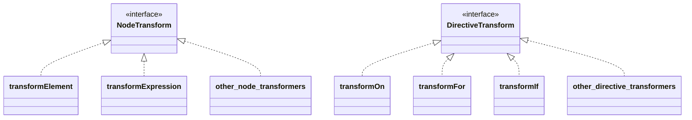

# Реализация Transformer и рефакторинг Codegen (Начало раздела базового компилятора шаблонов)

## Обзор существующей реализации

Теперь давайте более серьезно реализуем компилятор шаблонов с того места, где мы остановились в разделе минимального примера. Прошло некоторое время с тех пор, как мы работали над ним, поэтому давайте рассмотрим текущую реализацию. Основные ключевые слова - Parse, AST и Codegen.


```ts
export function baseCompile(
  template: string,
  option: Required<CompilerOptions>,
) {
  const ast = baseParse(template.trim())
  const code = generate(ast, option)
  return code
}
```

На самом деле, эта конфигурация немного отличается от оригинальной. Давайте посмотрим на оригинальный код.

https://github.com/vuejs/core/blob/37a14a5dae9999bbe684c6de400afc63658ffe90/packages/compiler-core/src/compile.ts#L61

Можете ли вы понять это...?

```ts
export function baseCompile(
  template: string,
  option: Required<CompilerOptions>,
) {
  const ast = baseParse(template.trim())
  transform(ast)
  const code = generate(ast, option)
  return code
}
```

Вот так.

В этот раз мы реализуем функцию `transform`.


## Что такое Transform?

Как вы можете догадаться из кода выше, AST, полученное путем парсинга, каким-то образом трансформируется функцией `transform`.

Вы можете получить представление, прочитав это.  
https://github.com/vuejs/core/blob/37a14a5dae9999bbe684c6de400afc63658ffe90/packages/compiler-core/src/ast.ts#L43C1-L51C23

Этот VNODE_CALL и AST код с именами, начинающимися с JS - это то, с чем мы будем работать в этот раз.
Компилятор шаблонов Vue.js разделен на две части: AST, который представляет результат парсинга шаблона, и AST, который представляет сгенерированный код.
Наша текущая реализация обрабатывает только первый AST.

Давайте рассмотрим случай, когда шаблон `<p>hello</p>` дается как входные данные.

Сначала следующий AST генерируется путем парсинга. Это то же самое, что и существующая реализация.

```ts
interface ElementNode {
  tag: string
  props: object /** опущено */
  children: (ElementNode | TextNode | InterpolationNode)[]
}

interface TextNode {
  content: string
}
```

```json
{
  "tag": "p",
  "props": {},
  "children": [{ "content": "hello" }]
}
```

Что касается "AST, который представляет сгенерированный код", давайте подумаем, какой код должен быть сгенерирован.
Я думаю, это будет что-то вроде этого:

```ts
h('p', {}, ['hello'])
```

Это AST, который представляет сгенерированный JavaScript код.
Другими словами, это объект, который представляет AST для генерации кода, который должен быть сгенерирован.

```ts
interface VNodeCall {
  tag: string
  props: PropsExpression
  children:
    | TemplateChildNode[] // несколько дочерних элементов
    | TemplateTextChildNode // один текстовый дочерний элемент
    | undefined
}

type PropsExpression = ObjectExpression | CallExpression | ExpressionNode
type TemplateChildNode = ElementNode | InterpolationNode | TextNode
```

```json
{
  "tag": "p",
  "props": {
    "type": "ObjectExpression",
    "properties": []
  },
  "children": { "content": "hello" }
}
```

Таким образом выражается AST, который представляет код, сгенерированный Codegen.
Возможно, вы не чувствуете необходимости разделять их на данный момент, но это будет полезно при реализации директив в будущем.
Разделяя AST, ориентированный на ввод, и AST, ориентированный на вывод, мы можем выполнить преобразование из `input AST -> output AST` с помощью функции под названием `transform`.

## Codegen Node

Теперь, когда мы поняли поток, давайте подтвердим, с каким типом Node мы будем работать (какой тип Node мы хотим преобразовать). Я объясню, перечисляя их и предоставляя комментарии. Пожалуйста, обратитесь к исходному коду для точной информации, так как некоторые части опущены.

```ts
export interface SimpleExpressionNode extends Node {
  type: NodeTypes.SIMPLE_EXPRESSION
  content: string
  isStatic: boolean
  identifiers?: string[]
}

// Это представляет выражение, которое вызывает функцию h.
// Предполагается что-то вроде `h("p", { class: 'message'}, ["hello"])`.
export interface VNodeCall extends Node {
  type: NodeTypes.VNODE_CALL
  tag: string | symbol
  props: ObjectExpression | undefined // ПРИМЕЧАНИЕ: В исходном коде реализовано как PropsExpression (для будущих расширений)
  children:
    | TemplateChildNode[] // несколько дочерних элементов
    | TemplateTextChildNode
    | undefined
}

export type JSChildNode =
  | VNodeCall
  | ObjectExpression
  | ArrayExpression
  | ExpressionNode

// Это представляет JavaScript Object. Используется для props VNodeCall и т.д.
export interface ObjectExpression extends Node {
  type: NodeTypes.JS_OBJECT_EXPRESSION
  properties: Array<Property>
}
export interface Property extends Node {
  type: NodeTypes.JS_PROPERTY
  key: ExpressionNode
  value: JSChildNode
}

// Это представляет JavaScript Array. Используется для children VNodeCall и т.д.
export interface ArrayExpression extends Node {
  type: NodeTypes.JS_ARRAY_EXPRESSION
  elements: Array<string | Node>
}
```

## Дизайн Transformer

Прежде чем реализовывать transformer, давайте поговорим о дизайне. Во-первых, важно отметить, что есть два типа трансформеров: NodeTransform и DirectiveTransform. Они используются для преобразования узлов и директив соответственно и имеют следующие интерфейсы.

```ts
export type NodeTransform = (
  node: RootNode | TemplateChildNode,
  context: TransformContext,
) => void | (() => void) | (() => void)[]

// TODO:
// export type DirectiveTransform = (
//   dir: DirectiveNode,
//   node: ElementNode,
//   context: TransformContext,
// ) => DirectiveTransformResult;
export type DirectiveTransform = Function
```

DirectiveTransform будет рассмотрен позже в главе при реализации директив, поэтому пока давайте назовем его Function.
И NodeTransform, и DirectiveTransform на самом деле являются функциями. Вы можете думать о них как о функциях для преобразования AST.
Обратите внимание, что результат NodeTransform - это функция. При реализации transform, если вы реализуете его так, чтобы он возвращал функцию, эта функция будет выполнена после преобразования этого узла (это называется процессом onExit).
Любая обработка, которую вы хотите выполнить после transform узла, должна быть описана здесь. Я объясню это вместе с описанием функции под названием traverseNode позже.
Объяснение интерфейса в основном описано выше.

И как более конкретная реализация, есть transformElement для преобразования Element и transformExpression для преобразования выражений и т.д.
Что касается реализации DirectiveTransform, есть реализации для каждой директивы.
Эти реализации реализованы в compiler-core/src/transforms. Конкретные процессы преобразования реализованы здесь.

https://github.com/vuejs/core/tree/37a14a5dae9999bbe684c6de400afc63658ffe90/packages/compiler-core/src/transforms

изображение ↓



Далее, о контексте, TransformContext содержит информацию и функции, используемые во время этих преобразований.
В будущем будет добавлено больше, но пока этого достаточно.

```ts
export interface TransformContext extends Required<TransformOptions> {
  currentNode: RootNode | TemplateChildNode | null
  parent: ParentNode | null
  childIndex: number
}
```

## Реализация Transformer

Теперь давайте посмотрим на функцию transform на практике. Сначала давайте начнем с общего объяснения фреймворка, который не зависит от содержания каждого процесса преобразования.

Структура очень проста, просто генерируем контекст и обходим узел с помощью функции traverseNode.
Эта функция traverseNode является основной реализацией преобразования.

```ts
export function transform(root: RootNode, options: TransformOptions) {
  const context = createTransformContext(root, options)
  traverseNode(root, context)
}
```

В traverseNode, в основном, просто применяются nodeTransforms (коллекция функций для преобразования Node), сохраненные в контексте, к узлу.
Для тех, у кого есть дочерние узлы, дочерние узлы также проходят через traverseNode.
Реализация onExit, о которой упоминалось во время объяснения интерфейса, также находится здесь.

```ts
export function traverseNode(
  node: RootNode | TemplateChildNode,
  context: TransformContext,
) {
  context.currentNode = node

  const { nodeTransforms } = context
  const exitFns = [] // Операции, которые нужно выполнить после преобразования
  for (let i = 0; i < nodeTransforms.length; i++) {
    const onExit = nodeTransforms[i](node, context)

    // Регистрация операций, которые нужно выполнить после преобразования
    if (onExit) {
      if (isArray(onExit)) {
        exitFns.push(...onExit)
      } else {
        exitFns.push(onExit)
      }
    }
    if (!context.currentNode) {
      return
    } else {
      node = context.currentNode
    }
  }

  switch (node.type) {
    case NodeTypes.INTERPOLATION:
      break
    case NodeTypes.ELEMENT:
    case NodeTypes.ROOT:
      traverseChildren(node, context)
      break
  }

  context.currentNode = node

  // Выполнение операций, которые нужно выполнить после преобразования
  let i = exitFns.length
  while (i--) {
    exitFns[i]() // Операции, которые можно выполнить, предполагая, что преобразование завершено
  }
}

export function traverseChildren(
  parent: ParentNode,
  context: TransformContext,
) {
  for (let i = 0; i < parent.children.length; i++) {
    const child = parent.children[i]
    if (isString(child)) continue
    context.parent = parent
    context.childIndex = i
    traverseNode(child, context)
  }
}
```

Далее давайте поговорим о конкретном процессе преобразования. В качестве примера давайте реализуем transformElement.

В transformElement мы в основном преобразуем узел типа NodeTypes.ELEMENT в VNodeCall.

```ts
export interface ElementNode extends Node {
  type: NodeTypes.ELEMENT
  tag: string
  props: Array<AttributeNode | DirectiveNode>
  children: TemplateChildNode[]
  isSelfClosing: boolean
  codegenNode: VNodeCall | SimpleExpressionNode | undefined
}

// ↓↓↓↓↓↓ Преобразование ↓↓↓↓↓↓ //

export interface VNodeCall extends Node {
  type: NodeTypes.VNODE_CALL
  tag: string | symbol
  props: PropsExpression | undefined
  children:
    | TemplateChildNode[] // несколько дочерних элементов
    | TemplateTextChildNode
    | undefined
}
```

Это простое преобразование объекта в объект, поэтому я не думаю, что это очень сложно. Давайте попробуем реализовать это, читая исходный код.  
Я вставлю код, который я предполагаю для этого раза, на всякий случай. (Поддержка директив будет сделана в другой главе.)

```ts
export const transformElement: NodeTransform = (node, context) => {
  return function postTransformElement() {
    node = context.currentNode!

    if (node.type !== NodeTypes.ELEMENT) return

    const { tag, props } = node

    const vnodeTag = `"${tag}"`
    let vnodeProps: VNodeCall['props']
    let vnodeChildren: VNodeCall['children']

    // props
    if (props.length > 0) {
      const propsBuildResult = buildProps(node)
      vnodeProps = propsBuildResult.props
    }

    // children
    if (node.children.length > 0) {
      if (node.children.length === 1) {
        const child = node.children[0]
        const type = child.type
        const hasDynamicTextChild = type === NodeTypes.INTERPOLATION

        if (hasDynamicTextChild || type === NodeTypes.TEXT) {
          vnodeChildren = child as TemplateTextChildNode
        } else {
          vnodeChildren = node.children
        }
      } else {
        vnodeChildren = node.children
      }
    }

    node.codegenNode = createVNodeCall(vnodeTag, vnodeProps, vnodeChildren)
  }
}

export function buildProps(node: ElementNode): {
  props: PropsExpression | undefined
  directives: DirectiveNode[]
} {
  const { props } = node
  let properties: ObjectExpression['properties'] = []
  const runtimeDirectives: DirectiveNode[] = []

  for (let i = 0; i < props.length; i++) {
    const prop = props[i]
    if (prop.type === NodeTypes.ATTRIBUTE) {
      const { name, value } = prop

      properties.push(
        createObjectProperty(
          createSimpleExpression(name, true),
          createSimpleExpression(value ? value.content : '', true),
        ),
      )
    } else {
      // директивы
      // TODO:
    }
  }

  let propsExpression: PropsExpression | undefined = undefined
  if (properties.length) {
    propsExpression = createObjectExpression(properties)
  }

  return {
    props: propsExpression,
    directives: runtimeDirectives,
  }
}
```

## Codegen на основе преобразованного AST

Поскольку мы преобразовали AST для Codegen, нам также нужно поддерживать Codegen.
Для AST, который поступает в Codegen, достаточно написать код, предполагая VNodeClass (и узлы, которые они имеют).
Желаемое конечное строковое представление такое же, как и раньше.

Существующая реализация Codegen очень проста, поэтому давайте сделаем ее немного более формальной здесь (потому что она довольно жестко закодирована).
Давайте также создадим специфичный для Codegen контекст и поместим в него сгенерированный код.
Кроме того, давайте реализуем некоторые вспомогательные функции в контексте (такие как отступы).

```ts
export interface CodegenContext {
  source: string
  code: string
  indentLevel: number
  line: 1
  column: 1
  offset: 0
  push(code: string, node?: CodegenNode): void
  indent(): void
  deindent(withoutNewLine?: boolean): void
  newline(): void
}
```

Я опущу детали реализации здесь, но я просто разделил функции по ролям, и нет существенных изменений в подходе к реализации.
Поскольку я еще не смог поддерживать директивы, есть некоторые части, которые не работают из-за удаления временной реализации в этой области, но
если код работает примерно следующим образом, это нормально!

```ts
import { createApp, defineComponent, ref } from 'chibivue'

const App = defineComponent({
  setup() {
    const count = ref(0)
    return { count }
  },

  template: `
    <div class="container">
      <p> Hello World! </p>
      <p> Count: {{ count }} </p>
    </div>
  `,
})

const app = createApp(App)

app.mount('#app')
```

Исходный код до этого момента:  
[chibivue (GitHub)](https://github.com/chibivue-land/chibivue/tree/main/book/impls/50_basic_template_compiler/010_transformer)
